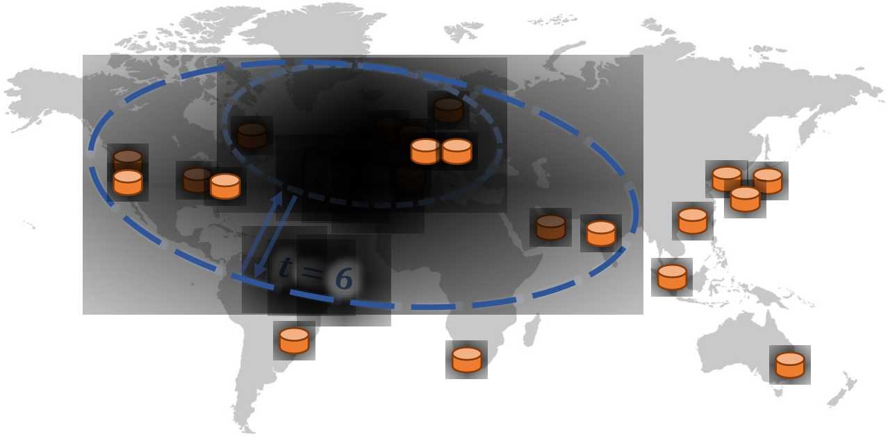

Mercury 0.3
----------

Fast Wide-Area Byzantine Replication with Mercury

This branch contains the source code for Mercury, an extension of AWARE and WHEAT/BFT-SMaRt.
Mercury autonomously optimizes the latency of quorum-based BFT consensus. For this purpose, it employs a dual resilience threshold that enables faster transaction ordering when the system contains few faulty replicas. Mercury allows forming compact quorums that substantially accelerate consensus using a smaller resilience threshold. Nevertheless, Mercury upholds standard SMR safety and liveness guarantees with optimal resilience, thanks to its judicious use of a dual operation mode and BFT forensics techniques. Our experiments spread tens of replicas across continents and reveal that Mercury can order transactions with finality in less than 0.4 seconds, half the time of a PBFT-like protocol (optimal in terms of number of communication steps and resilience) in the same network.


<p align="center">
    
</p>

A **technical description** of Mercury can be found in the **MIDDLEWARE'24** paper:

[Chasing Lightspeed Consensus:
Fast Wide-Area Byzantine Replication with Mercury](https://arxiv.org/abs/2305.15000)


This branch contains the sources of Mercury, which integrates BFT forensic support and can switch between two modes of execution. It also incorporates Byzantine Correctables to allow for client-side speculation.


*Important:
For evaluation purpose, we suggest to deploy Mercury in a wide-area network (WAN).*
In the following, we provide a description of how to (1) build, (2) configure, and (3) run this software.


----------


## Step 1: Check for Updates

Check if the version you pulled from an online repo includes all recent changes form the most stable `main` branch from the [GitHub repository](https://github.com/bergerch/Mercury). It's best to directly clone from the GitHub Repo we will maintain:


```
git clone git@github.com:bergerch/Mercury.git
```

If you cloned this repository from a different source (i.e., the ACM repo) then add a remote and run this command to pull the most recent updates (in Mercury directoy):

```
git remote add mercury https://github.com/bergerch/Mercury
```

```
git pull mercury main
```

Now you should have the most recent changes. Next step is to build the software.

## Step 2: Install Dependencies

We use Java (v. 11) and Gradle (v 7.1) for this project. If you have them already installed on your computer, then just skip this step otherwise you need to install them. For your convenience you may try the commands below:

```
sudo apt install openjdk-11-jdk
```

```
mkdir .gradle
cd .gradle
wget https\://services.gradle.org/distributions/gradle-7.1-bin.zip
unzip -d . gradle-7.1-bin.zip
```


## Step 3: Compile the Source Code


After installing Gradle just go into the main directory of the repo and type this command:


```
./gradlew installDist
```

The required jar files and default configuration files will be available in the `build/install/library` directory.


## Step 4: Defining a System Configuration

To run any demonstration you first need to configure Mercury/BFT-SMaRt to define the protocol behavior and the location of each replica.

The servers must be specified in the configuration file (see `config/hosts.config`):

```
#server id, address and port (the ids from 0 to n-1 are the service replicas) 
0 127.0.0.1 11000 11001
1 127.0.0.1 11010 11011
2 127.0.0.1 11020 11021
3 127.0.0.1 11030 11031
```

**Important tip #1:** Always provide IP addresses instead of hostnames. If a machine running a replica is not correctly configured, BFT-SMaRt may fail to bind to the appropriate IP address and use the loopback address instead (127.0.0.1). This phenomenom may prevent clients and/or replicas from successfully establishing a connection among them.


The system configurations also have to be specified (see `config/system.config`). A working configuration file is included but to understand the parameters we refer the interested reader to the paper.


## Step 5 (optional) Generating Public/Private Key Pairs

If you need to generate public/private keys for more replicas or clients, you can use the following command:

```
./runscripts/smartrun.sh bftsmart.tom.util.RSAKeyPairGenerator <id> <key size>
```

Keys are stored in the `config/keys` folder. The command above creates key pairs both for clients and replicas. Alternatively, you can set the `system.communication.defaultkeys` to `true` in the `config/system.config` file to force all processes to use the same public/private keys pair and secret key. This is useful when deploying experiments and benchmarks, because it enables the programmer to avoid generating keys for all principals involved in the system. However, this must not be used in real deployments.


## Step 6: Deployment in a WAN

In this step you deploy the system in a WAN. You can launch several virtual machines in different regions. Note that every VM needs to have Java 11 installed to run the Java Bytecode. You will have to copy the build in
`build/install/library`
to every VM as well as configuration files and keys.
Furthermore, note that firewall rules must be configured to allow TCP inbound and outbound traffic on the port range 11000 to 12000, or, the ports you defined yourself in Step 4.


**Important tip #2:** Never forget to delete the `config/currentView` file after you modify `config/hosts.config` or `config/system.config`. If `config/currentView` exists, BFT-SMaRt always fetches the group configuration from this file first. Otherwise, BFT-SMaRt fetches information from the other files and creates `config/currentView` from scratch. Note that `config/currentView` only stores information related to the group of replicas. You do not need to delete this file if, for instance, you want to enable the debugger or change the value of the request timeout.


## Step 7: Running the Replicas


You can run a single instance of a *ThrougputLatencyServer* (a replica used to conduct benchmarks) using the following command:

```
./runscripts/smartrun.sh bftsmart.demo.microbenchmarks.ThrougputLatencyServer 0 10000 0 0 false nosig

```

Note that you passed the following parameters:

`ThroughputLatencyServer <processId> <measurement interval> <reply size> <state size> <context?> <nosig | default | ecdsa> [rwd | rw]`


**Important tip #3:** If you are getting timeout messages, it is possible that the application you are running takes too long to process the requests or the network delay is too high and PROPOSE messages from the leader does not arrive in time, so replicas may start the leader change protocol. To prevent that, try to increase the `system.totalordermulticast.timeout` parameter in 'config/system.config'.


You need to repeat this procedure for all replicas on every VM, and increment the `<processId> ` for every replica. Make sure you use the correct `<processId>` as you defined with the `hosts.conf` in Step 4.


## Step 8: Running the Client(s)

**Important tip #4:** Clients requests should not be issued before all replicas have been properly initialized. Replicas are ready to process client requests when each one outputs `-- Ready to process operations` in the console.

Once all replicas are ready, the client can be launched as follows:

```
./runscripts/smartrun.sh bftsmart.demo.ThroughputLatencyClient 1001 1 10000 0 0 false false nosig
```

`ThroughputLatencyClient <initial client id> <number of clients> <number of operations> <request size> <interval (ms)> <read only?> <verbose?> <nosig | default | ecdsa>`

**Important tip #5:** Always make sure that each client uses a unique ID. Otherwise, clients may not be able to complete their operations.

## Step 9 (optional): Testing/Evaluation of Client-side Speculation

To evaluate the behavior of client-side speculation, the `Correctable` Interface must be used. For this purpose, we provide a separate implementations in 


`bftsmart.demo.ThroughputLatencyClientICG`


## Step 10 (optional): Reproduce Results from the Paper

Evaluation results depend on the speed of communication links in the WAN. 
Interestingly, we observed that links may become faster (to some extent) over large time intervals (years) because large cloud providers like Amazon AWS improve their infrastructure. For this purpose we provide latency data that allow an interested person to mimic the network characteristics we used by relying on high-fidelity network emulation/simulation tools like [Kollaps](https://github.com/miguelammatos/Kollaps) and [Shadow](https://github.com/shadow/shadow). 
These latency data can be found in the directories:

For the AWS setup with 21 regions see:
```
data/aws/aws.csv
```

For the wonderproxy setup with 51 regions see:
```
data/wonderproxy/wonderproxy.csv
```

## Additional information and publications

If you are interested in learning more about BFT-SMaRt, you can read:

- The paper about its state machine protocol published in [EDCC'12](http://www.di.fc.ul.pt/~bessani/publications/edcc12-modsmart.pdf):
- The paper about its advanced state transfer protocol published in [Usenix'13](http://www.di.fc.ul.pt/~bessani/publications/usenix13-dsmr.pdf):
- The tool description published in [DSN'14](http://www.di.fc.ul.pt/~bessani/publications/dsn14-bftsmart.pdf):
- WHEAT is published in [SRDS'15](https://doi.org/10.1109/SRDS.2015.40)
- AWARE is published in [TDSC'20](https://doi.org/10.1109/TDSC.2020.3030605)
- Mercury is published in [Middleware'24](https://arxiv.org/abs/2305.15000)

***Feel free to contact us if you have any questions!***


